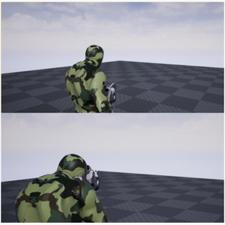

# TPS_ToyProject
언리얼 기본 애셋을 활용한 간단한 TPS 구현임.
'19년 여름에 짧게 시간제한을 두고, 그 시간 내에 여러 토픽(캐릭터 애니메이션, 발사체(프로젝타일), 충돌(콜리전), 에픽게임즈 무료 애셋 사용경험, 비헤이비어 트리 등) 중 얼마나 많이 얻을 수 있는지 도전한 프로젝트입니다.

## Features
에픽게임즈 애셋(애니메이션 스타터 팩)을 활용한 TPS

## 조작법
이동 :  WASD
조준 : 마우스 우클릭
발사 : 마우스 좌클릭
질주 : Shift
앉기 : 좌Ctrl

## 스크린샷

## 구현한 기능
애니메이션 블루프린트  
블렌드스페이스  
캐릭터 블루프린트  
무기 어태치

## 시도한 기능
구현한 기능 전부  
비헤이비어 트리를 이용한 AI 컨트롤러 구현  
외부 리소스(Environment Set)를 이용한 레벨디자인  
랜드스케이프  
발사체 콜리전
